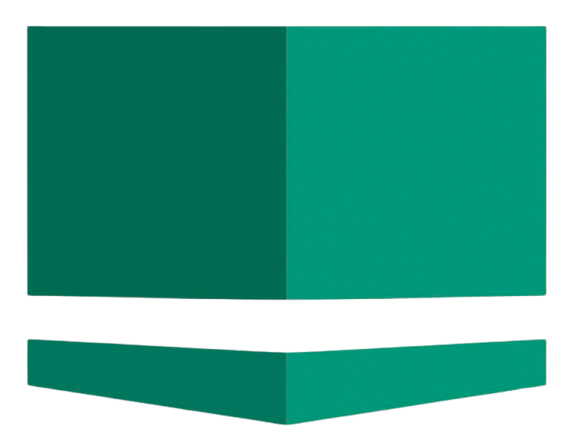
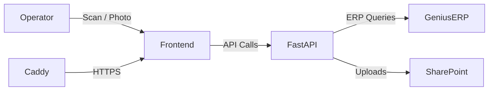

# Joulin Photos QC Tool  
*A self-hosted internal web application for shipping-line quality control*  

The Joulin Photos QC Tool enables operators to scan or enter sales orders, capture required photos, complete QC checklists, and automatically upload results (photos + logs + Excel checklists) into Microsoft SharePoint. The system is designed for **speed, reliability, and traceability** in a production environment.

---

## 📑 Table of Contents
- [Major Features](#-major-features)  
- [Tech Stack](#-tech-stack)  
- [System Architecture](#-system-architecture)  
- [Deployment](#-deployment)  
- [Configuration](#-configuration)  
- [Roadmap](#-roadmap)  
- [License](#-license)  

---

## 🚀 Major Features

- **Order Handling**  
  - Scan barcode or manually enter Sales Order #  
  - ERP lookup for order metadata (Genius ERP integration)  

- **Photo Capture**  
  - Canon camera integration with HUD preview  
  - Auto-save full-res photos + thumbnails  
  - Swipe zoom, autofocus, exposure & white balance adjustments  
  - Shutter sound + persistent sessions (resume after interruptions)  

- **QC Checklists**  
  - Pre-defined categories (Structure, Foam, Electrical, Pneumatics, Blower, Fit & Finish, Testing, Pre-Ship)  
  - JSON templates auto-generated from a CSV master file  
  - Per-item pass/fail + comments  

- **Uploads**  
  - Automatic SharePoint folder creation (`Customer/{OrderNo.Customer}`)  
  - Photos + generated Excel QC checklist uploaded together  
  - Resumable large-file uploads (Microsoft Graph API)  

- **Logging**  
  - Structured client-side logs (immediate, batched, per-session)  
  - Offline-safe storage (IndexedDB/localStorage)  
  - Sanitized server logs with rotation  

- **Deployment**  
  - Windows Server 2016 deployment  
  - Services managed with **NSSM**  
  - Reverse-proxy + TLS with **Caddy**  
  - Auto-redeploy via GitHub webhooks + ngrok  

---

## 🛠 Tech Stack

- **Backend**: Python, FastAPI, httpx (async Graph API)  
- **Frontend**: Vanilla JavaScript, HTML, CSS (custom HUD UI)  
- **ERP Integration**: Genius ERP API  
- **Storage**: Microsoft SharePoint via Graph API  
- **Web Server**: Uvicorn (ASGI) + Caddy (TLS + reverse proxy)  
- **Deployment**: Windows Server + NSSM for service management  

---

## 🏗 System Architecture

The system is composed of three major layers:

### **Frontend (Browser)**
- Runs locally in Chromium/Edge  
- Provides HUD for scanning orders, taking photos, and filling checklists  
- Handles offline session persistence and client-side logging  

### **Backend (FastAPI)**
- Order lookups (Genius ERP)  
- Session + logging endpoints  
- SharePoint integration (check folder, upload photos + Excel)  

### **Caddy Web Server**
- Serves static frontend files  
- Reverse-proxies `/api/*` → FastAPI backend  
- Provides internal HTTPS with local CA root certificate  



---

## 📦 Deployment

### Prerequisites
- Windows Server 2016+  
- Python 3.11+  
- Caddy  
- NSSM  

### 1. Clone & Setup
```bash
git clone <repo-url> C:\JoulinVisionTool
cd JoulinVisionTool
python -m venv .venv
.venv\Scripts\activate
pip install -r requirements.txt
```

### 2. Configure Environment  
Create `.env` with:  
```ini
APP_VERSION=x.x.x
APP_LOGGER=<app-logger-name>
API_BEARER_TOKEN=<your-generated-app-token>
GENIUS_HOST=<genius-erp-host>
GENIUS_COMPANY_CODE=<genius-erp-company-code>
GENIUS_USERNAME=<username>
GENIUS_PASSWORD=<pass>
ENTRA_TENANT_ID=<tenant>
ENTRA_CLIENT_ID=<client>
ENTRA_CLIENT_SECRET=<secret>
GRAPH_BASE=https://graph.microsoft.com/v1.0
GRAPH_SCOPE=https://graph.microsoft.com/.default
SHAREPOINT_DRIVE_ID=<drive-id>
SHAREPOINT_SITE_URL=<site-url>
GRAPH_ROOT_PATH=Shared Documents/[ETC]
GITHUB_WEBHOOK_SECRET=<optional-for-ngrok-webhook>
```

### 3. Install Services
#### For local dev only
```mac
./run-dev.sh
```
#### For full prod setup (ensuring adequate permissions)
```powershell
cd server
.\setup-prod-services.ps1
```

This installs:  
- `joulinphotos_nssm_service` (FastAPI backend)  
- `caddy` (reverse proxy + TLS)  

### 4. Verify
- Health check: http://127.0.0.1:8000/api/health  
- Client access: https://photos.joulin (trust root CA cert in `caddy-data/pki`)  

---

## ⚙️ Configuration

- **Caddyfile** → Reverse proxy rules + TLS  
- **setup-prod-ervices.ps1** → Service installation (NSSM)  
- **static/resources/qc_lib/** → JSON checklist templates  
- **.env** → Microsoft Graph + ERP credentials  

---

## 🔮 Roadmap

Planned features from GitHub Issues:  
- [ ] Automated CI/CD with unit tests  
- [ ] Public shipping-version of the app  
- [ ] AI-based photo verification & anomaly detection  
- [ ] Deployment to other Joulin sites (e.g., France)  

---

## 📜 License
MIT License © 2025 Victor Joulin-Batejat