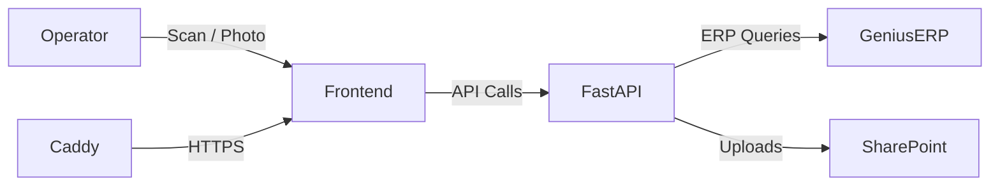
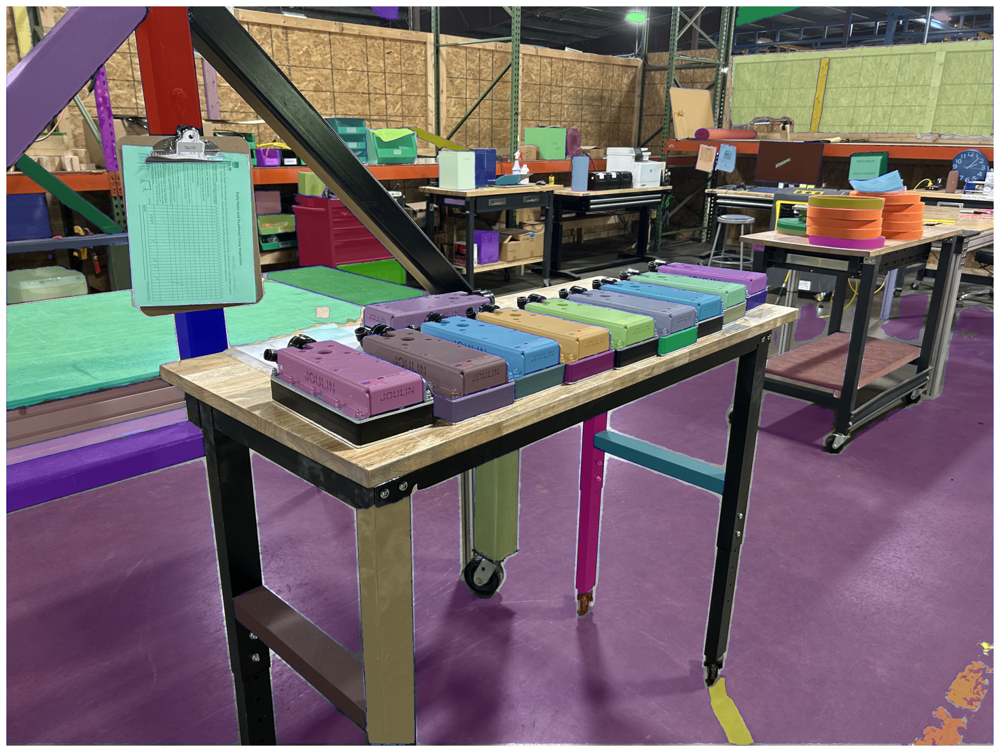
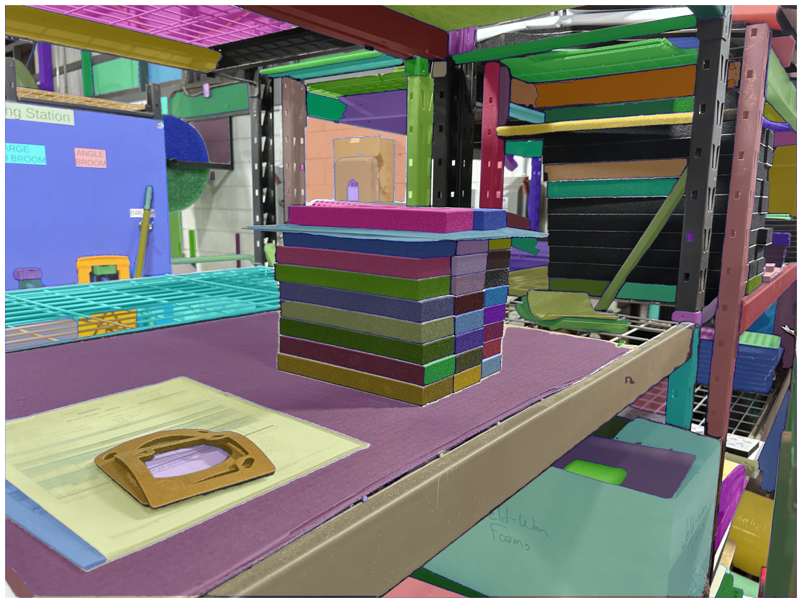

# Joulin Photos QC Tool  
*A self-hosted web platform for automated photo-based quality control in industrial shipping lines*

---

## 🔍 About This Project

This repository contains a **sanitized version** of the internal Photos QC Tool I designed and implemented as an **Engineering Intern at Joulin Vacuum Handling (Summer 2025)**.  
The system was deployed on-premises to automate **quality-control photo capture, checklist generation, and SharePoint upload**, improving traceability and cutting operator time by **~50%**.

---

## ⚙️ Tech Overview

| Layer | Technologies | Highlights |
|-------|---------------|-------------|
| **Frontend** | Vanilla JS / HTML / CSS | Offline queue, HUD camera, checklist UI |
| **Backend** | FastAPI + httpx (Async Graph API) | Order lookup, SharePoint upload, logging |
| **Infra** | Windows Server + NSSM + Caddy | TLS reverse proxy, service management |
| **Integration** | Genius ERP / Microsoft Graph API | Resumable uploads, folder auto-creation |

---

## 🧩 Key Features ([more details here](README-details.md#-major-features))

- **Smart Order Handling**  
  Scan barcode → ERP metadata lookup → auto-generated checklist.  

- **Camera & HUD UI**  
  Full-screen preview, focus/exposure controls, auto-save thumbnails.  

- **Automated Uploads**  
  Photos + Excel QC checklist → SharePoint via Graph API (resumable).  

- **Resilient Logging**  
  Structured JSON logs, offline queue, rotation, and sanitization.  

- **Infra Automation**  
  PS1 setup scripts, Caddy reverse proxy, and webhook-triggered redeploys. 

- **Check out [App Flow](APP-FLOW.md) for better idea of entire operator usage**


---

## 🧱 Architecture



> 📊 See the [Dependency Graph](static/resources/dependency-graph.svg) for full module relationships.  

---

## 🧰 Local Setup

```bash
git clone https://github.com/youruser/joulin-qc-portfolio.git
cd joulin-qc-portfolio
python -m venv .venv
.venv\Scripts\activate
pip install -r requirements.txt
```

Create `.env` (see `.env.example`) and run:

```bash
run-dev.sh
```

Then open [http://localhost:8000](http://localhost:8000).

---

## 🛠 Deployment

- Windows Server 2016+  
- Services via **NSSM**  
- TLS + reverse proxy via **Caddy**  
- Webhook redeploys through **ngrok + GitHub Actions**

---

## 📈 Results & Impact

> This project reduced manual QC logging time by ~95%,  
> increased photo traceability across manufacturing sites,  
> and served as the foundation for future AI-assisted anomaly detection.

---

## 🔮 Future Extensions

- ✅ CI/CD testing pipeline  
- 🤖 AI-based photo anomaly detection  
- 🌍 Multi-site deployment support (across Piab Group) 
- 🧩 Modular API for other ERP integrations  




---

## 🧾 License
MIT License © 2025 Victor Joulin-Batejat  
*(This repository is a sanitized portfolio example and not affiliated with Joulin Vacuum Handling.)*
